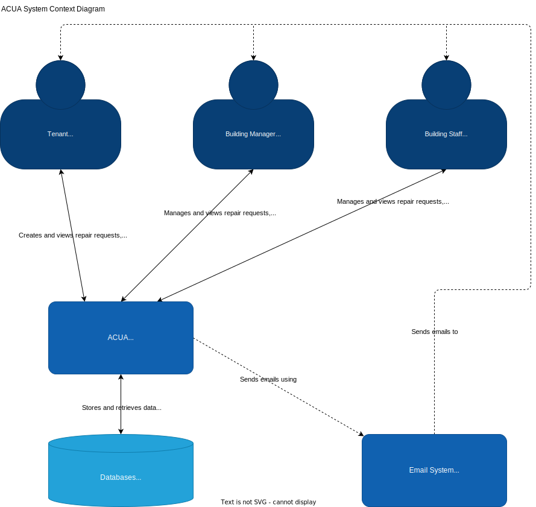

# C4 Model for ACUA

The Apartment Complex Utility App will be abbreviated as ACUA in this document.

## C1 - System Context Diagram

In this diagram we see three different users (roles) that can interact with ACUA. The tenant can use the application to create and view repair requests, reserve and view amenities, and receive notifications. The building staff can do all of the above, as well as manage repair requests,and manage amenities. The building manager can do all of the above, as well as view and manage building staff and the roles given to users.  
The system interacts with multiple databases to store and retrieve data, and can send emails to users using the email system.

## C2 - Container Diagram

In the diagram above you can see how the system consists of many different microservices deployed in a Kubernetes cluster. The frontend is a React application served by Nginx, while all microservices run on Node with Express.js. The frontend communicates with the backend through a REST API. The backend microservices communicate with each other through a message broker (Kafka). The backend microservices also communicate with their respective databases. The database system used is a PostgreSQL database by default.  
To ensure that no microservice is directly exposed to the outside world, as well as to provide a single entrypoint, the system uses the Kubernetes Gateway API, which can rewrite requests based on the URL path. This allows the frontend to make requests to the backend without having to know the IP address of the backend microservices. It also allows Kubernetes to work its magic by scaling up and down the backend microservices as needed.
